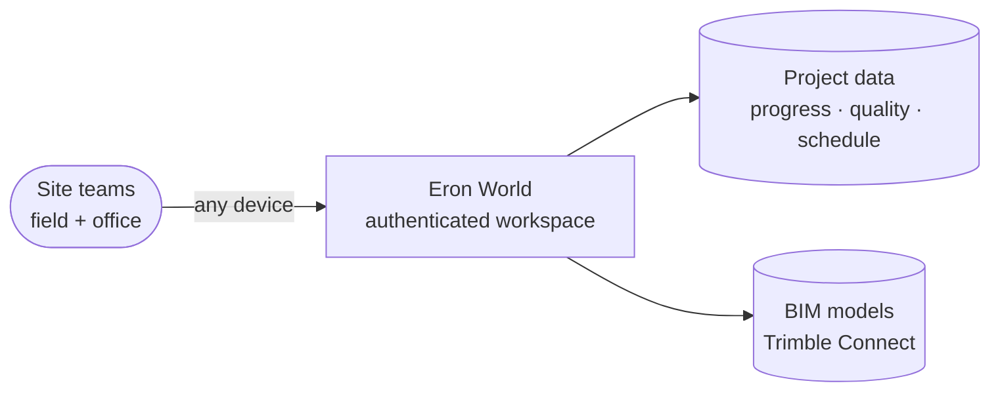

# Eron World

**Digitaliza tu obra** — construction management, built for the site.

---

## What we build

Eron World is a **B2B construction-management platform** for Spanish-speaking site teams. It brings the daily work of a construction project — progress reporting, quality observations, checklists, schedules, and BIM model data — into one authenticated workspace, so field and office see the same numbers in real time.

We build for the real conditions of a job site: mid-range Android phones on mobile data, crews who need answers in a glance, and managers who need the roll-up. Everything is in **Spanish (es-ES)**, direct and without clutter.

## Who it's for

Construction companies and their subcontractors — jefes de obra, quality teams, and project managers who today track progress across spreadsheets, WhatsApp, and disconnected tools. Eron World replaces that with a single source of truth, organized by project, section, and unit.

## What's inside

- **Avance** — progress by task, floor, and unit, with schedule-vs-real curves and deviation heatmaps.
- **Observaciones de Calidad** — quality issues from photo to closure, with a full authorization workflow.
- **Checklists** — site inspection templates, filled on the phone, rolled up for the office.
- **Cronograma** — project schedule with daily site reports and Uruguay workday rules.
- **Reportes** — read-only dashboards and charts, exportable to branded PDF and Excel.
- **Trimble Sync** — BIM model data from Trimble Connect, alongside the rest of the project.

## How it's built

A modern, cloud-native platform on **Microsoft Azure**. A **SvelteKit** web client delivers a fast, installable experience; a **C#/.NET** backend owns the domain logic and data. Sign-in is through **Microsoft Entra**, and the platform is migrating off a Power Platform origin onto this native stack, surface by surface, as each reaches parity.

## Engineering standards

- **Gated delivery** — no change reaches production without passing an automated quality gate (type-check, lint, unit, end-to-end) and post-deploy smoke checks; promotion is sequential and controlled.
- **Automated review** — every change goes through automated code review and dependency monitoring.
- **Privacy by default** — no personal data in URLs or telemetry; users are identified by opaque directory IDs.
- **Built for the low-end** — performance is measured against mid/low-end Android over mobile data, not a developer's laptop.

## Roadmap

Tracked on the private [project board](https://github.com/orgs/Eron-World/projects/2).

- **Shipped** — auth gate + invite flow, native Reportes / Observaciones / Checklists / Cronograma / Avance, Trimble Sync dashboard, branded PDF export, backend-driven authentication, production + preview environments.
- **In progress** — data-layer migration from the transitional store to Azure SQL behind a stable API.
- **Next** — decommission the legacy Power Pages portal at parity; Trimble Sync write surface.

> Repositories and the project board are **private**; access is granted by role.

---

## License

Proprietary. © Eron World. All rights reserved unless a repository states otherwise.

## Maintainer

**Gabriel Barnada** — [@glovek08](https://github.com/glovek08) · [eron.world](https://eron.world)
