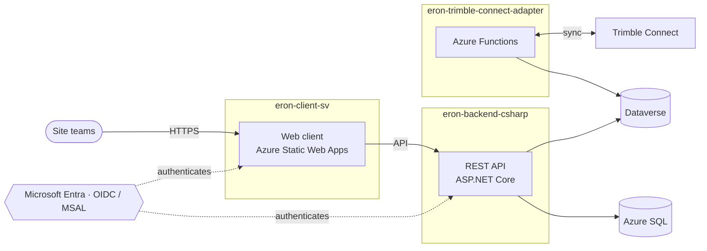

# Eron World

**Digitaliza tu obra** — a B2B construction-management platform for Spanish-speaking teams.

---

## What we build

Eron World is a construction-management SaaS for site teams — reporting, quality observations, and BIM data, in one authenticated workspace.

The platform began on **Microsoft Power Platform** (Power Pages portal + PowerApps Canvas apps + Dataverse) and is being migrated to a **native, cloud-native stack on Azure**: a SvelteKit web client and a C#/.NET backend, with a dedicated service that syncs Trimble Connect BIM data into the platform. Power Platform surfaces are rebuilt natively one by one and decommissioned as they reach parity.

---

## Repositories

| Repository | What it does | Stack | Status |
| :--------- | :----------- | :---- | :----- |
| [**eron-client-sv**](https://github.com/Eron-World/eron-client-sv) | User-facing web client — auth gate, app launcher, and native data surfaces (Reportes, Observaciones de Calidad, Trimble Sync). | SvelteKit · Svelte 5 · TypeScript |  `v0.4.3-alpha` |
| [**eron-backend-csharp**](https://github.com/Eron-World/eron-backend-csharp) | REST API backend — domain logic and the data layer migrating off Dataverse to Azure SQL. | .NET 10 · C# · ASP.NET Core |  `0.1.0-alpha` |
| [**eron-trimble-connect-adapter**](https://github.com/Eron-World/eron-trimble-connect-adapter) | Bidirectional sync between Trimble Connect BIM data and Dataverse, with an admin portal. | Azure Functions · .NET 10 · React |  |

> Repositories are **private**; the links resolve for members. Access is granted by role.

### eron-client-sv — web client

[-FF3E00?style=flat-square&logo=svelte&logoColor=white)](https://svelte.dev)

Authenticated client on Azure Static Web Apps. Sign-in via Microsoft Entra (OIDC/MSAL), app catalog from Dataverse, transactional email through Microsoft Graph. Native surfaces: **Reportes V2** (read-only tables + charts), **Observaciones de Calidad V2** (closure workflow with row-level security), and the **Trimble Sync** dashboard.

### eron-backend-csharp — REST API

Clean-architecture solution (`Domain` ▸ `Application` ▸ `Api`) with swappable infrastructure adapters (`Azure` · `Dataverse` · `SqlServer` · `Trimble`). Today it adapts Dataverse; persistence is migrating to Azure SQL behind stable ports. Infrastructure is provisioned as code (Bicep) across development, preview, and production.

### eron-trimble-connect-adapter — BIM sync

Azure Functions v4 backend with a React/Vite admin portal. Keeps BIM objects from Trimble Connect in sync with Dataverse via transparent PKCE auth, so model data is available to the rest of the platform.

---

## Architecture

---

## Roadmap

Tracked on the private [project board](https://github.com/orgs/Eron-World/projects/2). Highlights:

**Shipped**
- Authentication gate (Microsoft Entra / MSAL) with invite flow
- App launcher embedding the legacy PowerApps Canvas apps
- **Reportes V2** — native rebuild with charts and PDF/Excel export
- **Observaciones de Calidad V2** — native closure workflow with row-level security
- **Trimble Sync** — read-only sync dashboard
- Custom domains, production + preview deployments, SEO/indexing
- C#/.NET backend foundation (clean architecture, backend-driven OAuth)

**In progress**
- Data-layer migration: Dataverse → Azure SQL behind stable ports
- Backend-driven authentication and a clean RFC 9457 `problem+json` API contract

**Next**
- Decommission the legacy Power Pages portal once native parity is reached
- Validate the native rebuilds against the legacy Canvas apps (performance, UX, velocity)
- Trimble Sync write surface (property CRUD)

---

## Engineering standards

- **Gated CI** — no change reaches production without passing the quality gate (type-check, lint, unit, end-to-end), followed by post-deploy smoke checks.
- **Change control** — promotion is sequential and gated; direct pushes to production branches are not allowed.
- **Automated review** — every change goes through automated code review and dependency monitoring.
- **Privacy** — no personal data in URLs or telemetry; users are identified by opaque directory IDs.
- **Language** — all user-facing copy is **es-ES** (Spain Spanish).

---

## License

Proprietary. © Eron World. All rights reserved unless a repository states otherwise.

## Maintainer

**Gabriel Barnada** — [@glovek08](https://github.com/glovek08) · [eron.world](https://eron.world)
