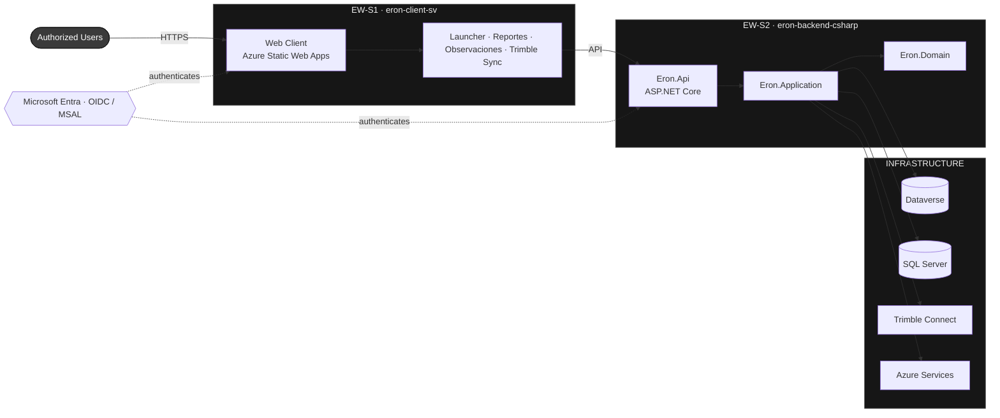

<div align="center">


# ERON WORLD

### CENTRAL SYSTEMS DIVISION

**DIGITAL OPERATIONS — CONSTRUCTION MANAGEMENT PLATFORM**


</div>

```
DOCUMENT CONTROL
──────────────────────────────────────────────────────────────────────
  DOCUMENT ............ Platform Systems Register
  DESIGNATOR .......... EW-SR-001
  REVISION ............ 2026.06 (REV C)
  PREPARING OFFICE .... Central Systems Division
  AUTHORITY ........... Office of the Chief Engineer
  DISTRIBUTION ........ Internal. Repository access governed by role.
  CLASSIFICATION ...... UNCLASSIFIED // FOR OFFICIAL USE ONLY
──────────────────────────────────────────────────────────────────────
```

---

## 1 — PROGRAM OVERVIEW

The Central Systems Division maintains the digital platform supporting Eron World's B2B construction-management operations. The standing mandate is the orderly decommission of the legacy Power Platform portal and the establishment of a sovereign, cloud-native successor on Microsoft Azure.

The platform is recorded as two systems: a client-facing application (**EW-S1**) and a core services backend (**EW-S2**). Both are under active development, governed by mandatory assurance gates, and deployed under change control.

---

## 2 — SYSTEM INVENTORY

| DESIGNATOR | SYSTEM                 | FUNCTION              | BASELINE               | STATUS          |
| :--------- | :--------------------- | :-------------------- | :--------------------- | :-------------- |
| `EW-S1`    | `eron-client-sv`       | Client application    | SvelteKit / TypeScript | ● OPERATIONAL   |
| `EW-S2`    | `eron-backend-csharp`  | Core services backend | .NET / C#              | ● OPERATIONAL   |

---

## 3 — SYSTEM RECORD · EW-S1

<div align="center">

### `eron-client-sv` — CLIENT APPLICATION


</div>

| FIELD                   | RECORD                                                                                                  |
| :---------------------- | :------------------------------------------------------------------------------------------------------ |
| `DESIGNATOR`            | EW-S1                                                                                                    |
| `REPOSITORY`            | `eron-client-sv`                                                                                         |
| `FUNCTION`              | Authenticated web client — application launcher, native data surfaces (Reportes, Observaciones de Calidad), and Trimble synchronization dashboard. |
| `OPERATING ENVIRONMENT` | Azure Static Web Apps (server-side rendering managed function)                                           |
| `TECHNOLOGY BASELINE`   | SvelteKit · Svelte 5 (runes) · TypeScript (strict) · SCSS (tokenized) · Vite · pnpm                      |
| `EXTERNAL INTERFACES`   | Microsoft Entra (OIDC / MSAL) · Microsoft Dataverse · Microsoft Graph · Trimble Connect                  |
| `ASSURANCE`             | Mandatory quality gate — static analysis, lint, unit (Vitest), end-to-end (Playwright); post-deployment smoke verification. |
| `CHANGE CONTROL`        | Sequential promotion: `claude# → claude-master → preview → main`                                         |
| `RELEASE BASELINE`      | v0.4.0-alpha (codename UTZON)                                                                            |
| `COMPOSITION`           | TypeScript 692k · Svelte 636k · SCSS 43k (bytes)                                                         |
| `SERVICE ENDPOINT`      | [preview.eron.world](https://preview.eron.world)                                                        |
| `OPERATIONAL STATUS`    | ● OPERATIONAL                                                                                            |

```
EW-S1 // OPERATIONAL STATUS
──────────────────────────────────────────────────────────────────────
  PRODUCTION   preview.eron.world ........................... ● ONLINE
  STAGING      preview slot ................................. ● ONLINE
  ASSURANCE    static analysis · lint · unit · end-to-end ... ● ENFORCED
  OVERSIGHT    automated review · dependency control ........ ● ACTIVE
──────────────────────────────────────────────────────────────────────
```

---

## 4 — SYSTEM RECORD · EW-S2

<div align="center">

### `eron-backend-csharp` — CORE SERVICES


</div>

| FIELD                   | RECORD                                                                                                  |
| :---------------------- | :------------------------------------------------------------------------------------------------------ |
| `DESIGNATOR`            | EW-S2                                                                                                    |
| `REPOSITORY`            | `eron-backend-csharp`                                                                                    |
| `FUNCTION`              | Core services backend — domain logic, data custody, and the integration backbone for the platform.      |
| `OPERATING ENVIRONMENT` | Azure Cloud · containerized (Docker)                                                                     |
| `TECHNOLOGY BASELINE`   | .NET · C# · ASP.NET Core · Clean Architecture · Bicep (infrastructure as code)                           |
| `SYSTEM COMPOSITION`    | `Domain` ▸ `Application` ▸ `Api`, with Infrastructure adapters: `Azure` · `Dataverse` · `SqlServer` · `Trimble` |
| `EXTERNAL INTERFACES`   | Microsoft Dataverse · SQL Server · Trimble Connect · Azure Services                                      |
| `ASSURANCE`             | Continuous integration · quality gate · infrastructure validation (Bicep)                               |
| `DEPLOYMENT`            | Segregated environments — Development · Preview · Production (provisioned by code)                       |
| `COMPOSITION`           | C# 94k · Bicep 10k · PowerShell · Shell · Docker (bytes)                                                 |
| `OPERATIONAL STATUS`    | ● OPERATIONAL                                                                                            |

```
EW-S2 // OPERATIONAL STATUS
──────────────────────────────────────────────────────────────────────
  PRODUCTION    Azure (provisioned by code) ................. ● ONLINE
  PREVIEW       staging environment ........................ ● ONLINE
  DEVELOPMENT   development environment .................... ● ONLINE
  ASSURANCE     CI · quality gate · infrastructure check .... ● ENFORCED
  OVERSIGHT     automated review ........................... ● ACTIVE
──────────────────────────────────────────────────────────────────────
```

---

## 5 — SYSTEM ARCHITECTURE & DATA FLOW



---

## 6 — SECURITY & GOVERNANCE CONTROLS

- **ACCESS** — system repositories are private; access is granted by role.
- **CHANGE CONTROL** — no change reaches production without passing the mandatory quality gate.
- **AUTHORIZATION CHAIN** — promotion is sequential and gated; direct commits to production-bearing branches are prohibited.
- **AUTOMATED OVERSIGHT** — automated code review and dependency monitoring apply to all changes.
- **DATA HANDLING** — no personal data is carried in URLs or telemetry without explicit authorization; users are identified by opaque directory identifiers only.
- **LANGUAGE OF RECORD** — client communications are standardized to es-ES.

---

## 7 — POINTS OF CONTACT

| ROLE                                | NAME            | DIRECTORY                                  |
| :---------------------------------- | :-------------- | :----------------------------------------- |
| System Owner / Technical Authority  | Gabriel Barnada | [@glovek08](https://github.com/glovek08)   |

---

<div align="center">


`END OF DOCUMENT — EW-SR-001`

</div>
