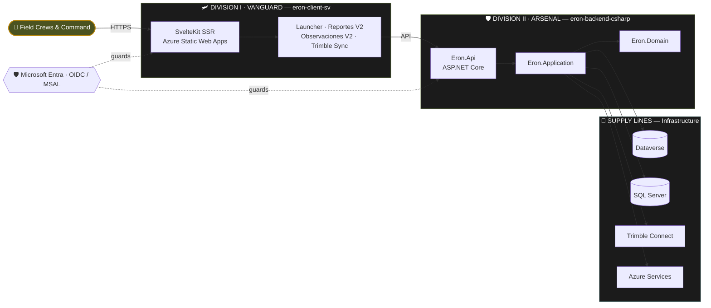

<div align="center">

<!-- ═══════════════════════════ COMMAND BANNER ═══════════════════════════ -->

# ◣ ⬛ E R O N · W O R L D ⬛ ◢

### ▰▰▰▱ CONSTRUCTION COMMAND · DIGITAL OPERATIONS DIVISION ▱▰▰▰


> _“We don’t pour the concrete. We command the systems that do.”_

</div>

---

## ★ THEATER OF OPERATIONS

**MISSION DIRECTIVE —** Decommission the legacy Power Platform portal and seize the modern stack: a sovereign, containerized, cloud-native platform for B2B construction management. Two divisions hold the line — one at the **front** (the cockpit the crews operate), one in the **core** (the engine that moves the data).

```
┌─ SITREP // THEATER STATUS ───────────────────────────────────────────────┐
│                                                                           │
│   AO ............. Azure Cloud  ·  SWA · Functions · Dataverse · SQL       │
│   FRONT .......... eron-client-sv        [ SvelteKit · TypeScript ]        │
│   CORE ........... eron-backend-csharp   [ .NET · Clean Architecture ]     │
│   SUPPLY LINES ... Microsoft Entra · Microsoft Graph · Trimble Connect     │
│   POSTURE ........ ACTIVE — continuous deployment, fortified quality gates │
│   READINESS ...... 🟩 GREEN  ·  all divisions operational                  │
│                                                                           │
└───────────────────────────────────────────────────────────────────────────┘
```

---

<div align="center">

## ▰▰▰  ORDER OF BATTLE  ▰▰▰

</div>

<!-- ════════════════════════════ DIVISION I ════════════════════════════ -->

<div align="center">

### 🛩️ DIVISION I · «VANGUARD»

#### `eron-client-sv` — THE FRONT LINE


</div>

> **BRIEFING —** The forward-deployed web client: an auth-gated app launcher, native Dataverse surfaces (Reportes V2, Observaciones de Calidad V2), and the Trimble Sync dashboard. Spanish-first (es-ES), token-driven theming, hand-built for construction crews who deserve to feel VIP.

| FIELD | INTEL |
| :--- | :--- |
| `CALLSIGN` | **VANGUARD** — 1st Interface Division |
| `ROLE` | Forward web client — the cockpit the crews operate |
| `THEATER` | Browser ▸ Azure Static Web Apps (SSR managed function) |
| `ARMAMENT` | SvelteKit · Svelte 5 (runes) · TypeScript (strict) · SCSS (tokenized) |
| `RECON & COMMS` | Microsoft Entra (OIDC/MSAL) · Dataverse · Microsoft Graph · Trimble Sync |
| `FORTIFICATIONS` | Quality Gate — svelte-check · ESLint · Vitest · Playwright e2e + post-deploy Smoke |
| `DEPLOYMENT` | CD via Azure SWA · doctrine `claude# → claude-master → preview → main` |
| `CAMPAIGN` | `v0.4.0-alpha «Utzon»` — releases bear master-architect codenames |
| `STRENGTH` | TypeScript **692k** · Svelte **636k** · SCSS **43k** |
| `FWD BASE` | 🌐 [preview.eron.world](https://preview.eron.world) |
| `READINESS` | 🟩 **OPERATIONAL** |

```
[ VANGUARD // DEPLOYMENT BOARD ]
  main ......... preview.eron.world .............................. ● LIVE
  preview ...... staging slot (azurestaticapps) .................. ● LIVE
  gate ......... svelte-check · eslint · vitest · playwright ..... ● ARMED
  overwatch .... Claude · Copilot · Dependabot ................... ● STANDING
```

---

<!-- ════════════════════════════ DIVISION II ════════════════════════════ -->

<div align="center">

### 🛡️ DIVISION II · «ARSENAL»

#### `eron-backend-csharp` — THE CORE


</div>

> **BRIEFING —** The heavy artillery: a Clean Architecture .NET solution that owns the domain logic, the data, and the integration backbone. Dependencies point inward — `Domain` takes orders from no one; `Application` directs the campaign; `Infrastructure` runs the supply lines to Dataverse, SQL Server, Azure, and Trimble. Containerized and provisioned by code.

| FIELD | INTEL |
| :--- | :--- |
| `CALLSIGN` | **ARSENAL** — 2nd Core Division |
| `ROLE` | The core engine — domain logic, data & integration heavy artillery |
| `THEATER` | Azure Cloud ▸ Docker containers |
| `ARMAMENT` | .NET · C# · ASP.NET Core · Clean Architecture · Bicep IaC |
| `ORDER OF BATTLE` | `Domain` ▸ `Application` ▸ `Api`, flanked by `Infrastructure.{Azure · Dataverse · SqlServer · Trimble}` |
| `SUPPLY LINES` | Dataverse · SQL Server · Trimble Connect · Azure Services |
| `FORTIFICATIONS` | CI · Quality gate · Bicep infra validation |
| `DEPLOYMENT` | Triphasic — `Development` ▸ `Preview` ▸ `Production`, IaC-provisioned |
| `STRENGTH` | C# **94k** · Bicep **10k** · PowerShell · Shell · Docker |
| `READINESS` | 🟩 **ACTIVE — forward-deploying** |

```
[ ARSENAL // DEPLOYMENT BOARD ]
  production ... Azure (Bicep-provisioned) ...................... ● HELD
  preview ...... staging environment ........................... ● HELD
  development .. dev environment ............................... ● HELD
  gate ......... CI · quality · infra validation ............... ● ARMED
  overwatch .... Claude · CI sentries .......................... ● STANDING
```

---

## ⚙ COMBINED ARMS — BATTLE MAP



---

## 🎖 RULES OF ENGAGEMENT

- **Language of command** — all client-facing comms in **es-ES** (Spanish, Spain). Direct, professional, no fluff.
- **No breach without clearance** — nothing merges past a **fortified quality gate** (type-check, lint, unit, build, e2e).
- **Branch doctrine** — advance `claude# → claude-master → preview → main`. Never flank straight to `main`.
- **Standing overwatch** — Claude & Copilot stand review; Dependabot guards the supply chain.
- **Architecture is doctrine** — tokens over hex, runes over legacy, dependencies point inward.

---

<div align="center">

### ⭐ CHAIN OF COMMAND ⭐

**Commanding Officer —** [@glovek08](https://github.com/glovek08) · Gabriel Barnada

<br/>


`— END OF BRIEFING —`

▰▰▰▱▱  **ERON WORLD** · DIGITAL OPERATIONS  ▱▱▰▰▰

</div>
